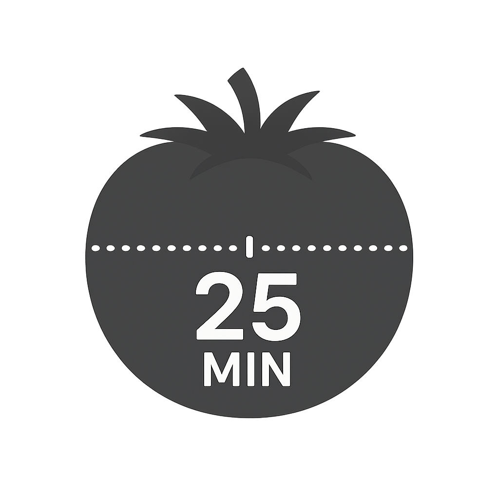

# 🍅 Pomodoro Timer

<div align="center">
  
  
  **Simple and effective Pomodoro Timer for productivity enhancement**
  
  
  
  
  
</div>

---

## ✨ Features

- ⏰ **25-minute work sessions** with short and long breaks
- 🔧 **Customizable time intervals**
- 📊 **Session tracking** and statistics
- 🔔 **Notifications** on session completion
- 🖥️ **System tray** with quick access
- ⌨️ **Keyboard shortcuts** for convenient control

## 🚀 Quick Start

### Requirements
- C++17 compiler (GCC/Clang)
- Qt 6.0+
- CMake 3.16+

### Build and Run
```bash
# Clone the repository
git clone <repository-url>
cd Pomodoro

# Create build directory
mkdir build && cd build

# Build the project
cmake ..
make

# Run the application
./PomodoroTimer
```

## 📄 License

This project is licensed under the [MIT License](LICENSE).

---

<div align="center">
  <b>Made with ❤️ for productivity enhancement</b>
</div>
